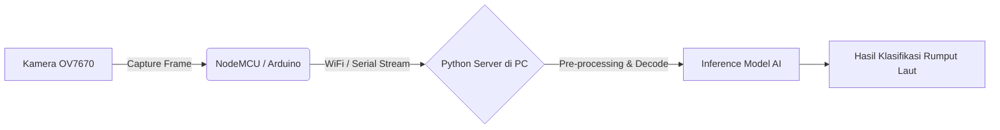

# 🛠️ Technical Details: Seaweed Image Classification

Dokumen ini menjelaskan rancangan teknis, arsitektur data, dan alur integrasi perangkat keras dalam sistem **AI Klasifikasi Rumput Laut**.

## 1. Arsitektur Model AI (CNN)
Pendekatan utama pengenalan dan klasifikasi gambar menggunakan arsitektur *Convolutional Neural Network* (CNN) yang dibangun di atas **TensorFlow** dan **Keras**. 
* **Input Layer**: Menerima gambar yang telah diubah ukurannya (resize) ke dimensi tertentu secara konsisten (misalnya 128x128 atau 224x224 piksel).
* **Convolutional Layers**: Mengekstraksi fitur penting dari tekstur, bentuk, dan warna rumput laut menggunakan sejumlah filter.
* **Pooling Layers (Max Pooling)**: Mengurangi dimensi spasial dari fitur yang diekstrak untuk mempercepat komputasi dan mengurangi *overfitting*.
* **Fully Connected Layers (Dense)**: Mengolah peta fitur menjadi keputusan klasifikasi.
* **Output Layer**: Menggunakan fungsi aktivasi *Softmax* (jika multiclass) atau *Sigmoid* (jika binary) untuk menentukan persentase/probabilitas kelas rumput laut (misal: Baik vs Buruk).

## 2. Alur Integrasi Data: Arduino Cam (OV7670)
Data gambar yang digunakan untuk inferensi secara *real-time* tidak berasal dari gambar statis lokal atau *webcam* standar, melainkan dari perangkat IoT berupa **Arduino Camera**.

### Skema Perangkat Keras:
1. **Kamera OV7670**: Modul kamera kompak yang digunakan untuk menangkap kondisi fisik rumput laut.
2. **Mikrokontroler (Arduino/NodeMCU/ESP32)**: Otak utama di sisi *hardware* yang bertugas mengontrol modul kamera OV7670, menangkap frame gambar (buffer), dan mempersiapkannya untuk dikirim.
3. **Transmisi Data**: Mikrokontroler akan mentransmisikan data gambar ke PC atau Server lokal. Metode yang bisa digunakan antara lain:
   - **Komunikasi Serial (UART)**: Mengirimkan urutan byte gambar melalui kabel USB.
   - **Komunikasi Nirkabel (WiFi)**: Jika menggunakan NodeMCU/ESP, gambar bisa dikirim via protokol HTTP (sebagai request POST) atau WebSocket.
4. **PC/Server (Python)**: Sebuah skrip Python akan secara aktif *listening* (mendengarkan) transmisi tersebut. Skrip ini akan melakukan *decoding* terhadap stream byte menjadi objek matriks gambar (misalnya menggunakan OpenCV `cv2.imdecode`), lalu mengumpankannya (feed) ke model AI untuk prediksi.

### Diagram Alur Sistem:

## 3. Dataset dan Pelatihan (Training)
* **Pengumpulan Data**: Dataset latih (`training data`) dikumpulkan dan disimpan di dalam folder `data/` dengan struktur *sub-folder* yang mewakili masing-masing kelas (kategori label).
* **Pre-processing Data**:
  - **Normalisasi**: Skalasi nilai piksel gambar dari `[0, 255]` menjadi rentang `[0, 1]`.
  - **Data Augmentation**: Dilakukan rotasi, pergeseran (shift), flip, atau zoom secara acak pada dataset pelatihan menggunakan `ImageDataGenerator`. Hal ini dilakukan untuk menambah variasi data dan membuat model lebih kebal terhadap kondisi pengambilan gambar Arduino yang mungkin tidak selalu pas posisinya.
* **Penyimpanan Model**: Setelah proses *training* di Jupyter Notebook selesai dan dievaluasi, model akhir akan disimpan di direktori `models/` sebagai berkas berformat `.h5` atau format bawaan `SavedModel`. Model inilah yang nantinya akan di-load kembali oleh skrip PC saat menerima gambar baru dari Arduino Cam.
